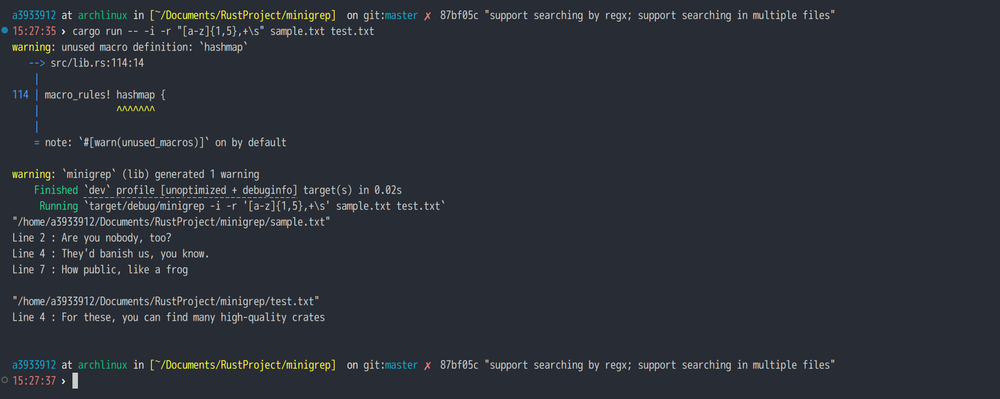

Rust 入门实战：文件搜索小工具 minigrep

链接：[Rust语言圣经(Rust Course)](https://course.rs/about-book.html)

## 20240615

- 基本框架
- 使用 HashMap 记录查找到的行和对应的行号

## 20240623

- 使用 clap 包处理命令行输入
- 可以对多个文件进行查找
- 支持正则表达式。由于正则表达式自带忽略大小写的标志，因此 `-i` 和 `-r` 同时出现时 `-i` 标志位将不起作用
- 对搜索结果的输出做了一些调整  

  